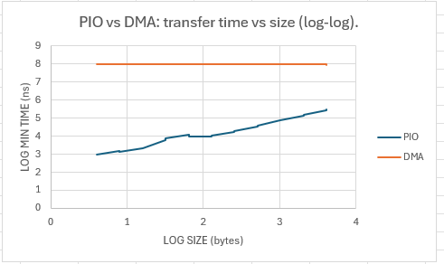

# QEMU EDU Linux Kernel PCI Driver

A Linux kernel PCI driver for QEMU's EDU virtual device. MMIO, MSI interrupts,
and DMA, plus a userspace library and a latency/throughput benchmark.
Developed and tested against the EDU device inside a QEMU VM. Work in progress.

## Phase 1: PCI enumeration

`src/edu.c` is a minimal PCI driver that binds to the QEMU EDU device
(`1234:11e8`). It registers a `pci_driver` whose ID table matches the device,
so the kernel calls the driver's `probe()` automatically when the device is
present. `probe()` enables the device (`pci_enable_device`, error-checked);
`remove()` disables it on unload.

### Build & load (inside the guest)
```bash
cd /mnt/host
make
sudo insmod edu.ko      # kernel calls probe() → "Successfully enabled PCI device"
sudo dmesg | tail
sudo rmmod edu          # runs remove()
```

`probe()` enables the device, claims BAR 0, maps it into kernel space with `ioremap()`, and reads the EDU identification register at offset 0x00 over MMIO. The expected value for this is `0x010000ed`. The teardown in case of errors includes the use of a `goto` keyword so any failure unwinds smoothly and as intended, in reverse. `remove()` unmaps and releases in LIFO order. 

## Phase 2: Character device and file operations

The driver exposes the EDU device to userspace as a character device at
`/dev/edu`, registered with `misc_register` (dynamic minor under the shared
misc major). Per-device state lives in a `struct edu_device` allocated in
`probe()` with `devm_kzalloc`, which embeds the `miscdevice` so that read and
write can recover the device from `filp->private_data`.

`write()` takes a 4-byte unsigned integer and stores it in the factorial
computation register (0x08), which triggers the device. `read()` polls bit 0
of the status register (0x20) until the device signals completion, then returns
the result from 0x08. The interface validates the transfer length, checks the
result of every userspace copy, guards against reading before a write, and
rejects inputs above 12 (13! exceeds a 32-bit result).

### Usage (inside the guest, module loaded)
```bash
# Write the integer 5 as raw little-endian bytes
printf '\x05\x00\x00\x00' | sudo tee /dev/edu > /dev/null

# Read the 4-byte result back as an unsigned integer
sudo od -An -tu4 /dev/edu      # -> 120
```

The device node is created by `misc_register` in `probe()` and removed by
`misc_deregister` in `remove()`, so it exists only while the module is loaded.

## Userspace Test App (edu_test.c)

A small userspace C app that opens `/dev/edu`, writes an integer to it, and reads back
the factorial the device computed. Basically the terminal `printf`/`od` handshake from
Phase 2, but automated in one program.

This is not the real library (that comes later). It just proves the write and read
path can be wrapped in userspace code, and lays the groundwork for the actual library later.

### What it uses
- `fcntl.h` for `open()`
- `unistd.h` for `write()`, `read()`, `close()`
- `errno.h` and `stdio.h` for error reporting
- `stdint.h` for fixed-width int types

Opens the device with `O_RDWR` so the same file descriptor can both write and read.
On any failure the syscall returns -1 and sets `errno`, which the app prints so you can
see exactly what the driver rejected.

### Build and run

```bash
cd /mnt/host/src && make && sudo insmod edu.ko
cd /mnt/host/userspace && gcc -Wall -Wextra -o edu_test edu_test.c
sudo ./edu_test
```

### What it checks
- Input 5 returns 120
- Input 13 returns -EOVERFLOW (13! overflows u32)
- Read before write returns -EAGAIN
- Wrong length returns -EINVAL

## MSI interrupt-driven I/O
 
Phase 2 worked by polling: `read()` spun on the status register until the device
cleared the busy bit, burning a CPU core just to wait. It replaces that with
a real interrupt. The device signals when it is finished, and the reading process
sleeps until then instead of spinning.
 
### How it works
 
The flow spans two contexts. The `write()`/`read()` path runs in process context and
can sleep. The interrupt handler runs in interrupt context and cannot sleep. They coordinate
through a `struct completion`.
 
`write()` arms the interrupt by setting bit 7 (`0x80`) in the status register (0x20),
then writes the input to the factorial register (0x08) to start the computation. Order
matters: the device checks the interrupt-enable bit when the computation finishes, so
arming must happen before the trigger.
 
`read()` calls `wait_for_completion_interruptible`, which sleeps and hands the CPU back
to the system. When the device finishes, it raises an MSI. The handler reads the interrupt
status register (0x24) to confirm the cause, acknowledges it by writing that value back to
the acknowledge register (0x64), then calls `complete()` to wake the reader. The reader
resumes, reads the result from 0x08, copies it to userspace, and returns.
 
### Key design decisions

Check my [ENGINEERING_NOTES](ENGINEERING_NOTES.md) file for more information on these design decisions. A lot of debugging went into completing this phase of the project. The difference was a single line `pci_set_master`. 
 
- **`struct completion` over a raw wait queue.** A completion is a wait queue plus a done
  flag plus the locking that makes them race-free. The device can finish and fire the
  interrupt before `read()` reaches its sleep call. A bare wait queue would lose that wake
  and the reader would sleep forever; a completion records that the event happened, so a
  later wait returns immediately. `reinit_completion` runs at the start of each write so a
  stale completion cannot let the next read return early.
- **MSI, not INTx.** The driver requests one MSI vector with `pci_alloc_irq_vectors(dev, 1, 1, PCI_IRQ_MSI)`
  and gets the IRQ number from `pci_irq_vector`, not `pdev->irq`. The `request_irq` flags are 0,
  since an MSI vector is dedicated, not a shared wire.
- **The acknowledge quirk.** The device requires the acknowledge register to be written even
  under MSI. Under INTx, skipping it leaves the line asserted and the handler fires forever.
  Under MSI there is no line, but the status register keeps its stale bits, which corrupts the
  next decode. So the handler acks the exact value it read.
- **Bus mastering.** `probe()` calls `pci_set_master`. An MSI is delivered as a memory write,
  and a PCI device can only initiate writes if it is a bus master. Without this the device
  raised the interrupt but the write was dropped and the handler never ran. DMA also depends on the same permission.
- **Concurrency.** The only state shared between the handler and the file operations is the
  completion, which is internally locked, so no spinlock is needed here. A mutex would not be
  an option anyway, since the handler cannot sleep and a mutex can.
### Teardown
 
`remove()` releases the handler with `free_irq` before releasing the vector with
`pci_free_irq_vectors`, so no interrupt can arrive after the handler is gone. Bus mastering is
cleared with `pci_clear_master`, and the rest unwinds in reverse order of setup.
 
### Verifying it works
 
```bash
cd /mnt/host/src && make && sudo insmod edu.ko
 
# Handler registered, count starts at 0
cat /proc/interrupts | grep edu
 
# Trigger a factorial
printf '\x05\x00\x00\x00' | sudo tee /dev/edu > /dev/null
sudo od -An -tu4 /dev/edu
 
# Count is now 1: the result came via a real interrupt, not the old busy-poll
cat /proc/interrupts | grep edu
```

## ioctl Interface and DMA

The driver exposes DMA transfers through `ioctl` on `/dev/edu`, alongside the
existing `read`/`write` factorial path.

### Shared ABI header

`edu_ioctl.h` is compiled by both the driver and userspace, so the command
numbers and argument layout can never drift apart. Commands are built with the
`_IOWR` macros, which pack a magic letter, a sequence number, the direction
bits, and `sizeof(struct edu_dma_arg)` into a single 32-bit value.

The argument struct uses fixed-width `__u64` fields for size, user buffer
address, and elapsed time. Fixed-width types matter here: `size_t` and `void *`
change size between a 32-bit userspace process and a 64-bit kernel, which would
change the struct layout and the encoded `sizeof`, breaking the ABI silently.
The user pointer is carried as a `__u64` and cast to `void __user *` on the
kernel side.

The direction bits describe the argument struct, not the DMA. Both transfer
commands are `_IOWR` because userspace fills the struct in and the kernel writes
the measured elapsed time back into it. The payload buffer that `data_ptr` names
is a separate allocation and does not affect the macro choice.

### Transfer path

Two boundaries are crossed on every transfer, not one:

- `copy_from_user` / `copy_to_user` moves data between the userspace buffer and
  the driver's DMA buffer
- the DMA engine moves data between that buffer and the device's internal 4 KB
  buffer at offset `0x40000`

Order matters. Writing to the device copies from userspace first, then starts
the DMA. Reading from the device runs the DMA first, then copies out, and only
if the transfer actually succeeded.

The DMA buffer comes from `dma_alloc_coherent`, which returns two views of the
same memory: a kernel virtual address for the CPU and a bus address for the
device. Coherent mapping means no explicit cache synchronisation is needed
between the two. A 28-bit DMA mask is set before allocation, as the EDU device
supports only 28-bit addressing by default. That mask is also what makes it
safe to program the bus address with a 32-bit `iowrite32`.

This is a copy-based DMA design rather than zero-copy. The user's buffer is
never touched by the device, so its alignment and physical layout are
irrelevant, and no page pinning is required. The cost is one extra copy per
transfer, which shows up in the benchmark.

### Validation

The transfer size is validated in the ioctl handler, immediately after the
argument struct is unpacked and before any copy runs. Validating at the trust
boundary rather than at the point of use matters here: the size reaches
`copy_from_user` before it ever reaches the DMA engine, so a check further down
would fire only after 4 KB of kernel heap had already been overrun. The bound is
also enforced inside the transfer function as defence in depth.

### Verifying the transfer is real

A naive round-trip test writes a pattern to the device, reads it back, and
compares. That test passes even when the DMA does nothing, because the driver's
buffer still holds the pattern from the outbound copy. The read path therefore
fills the buffer with a known poison value before starting the inbound transfer,
so anything read back is provably new data from the device.

Confirmed working: 20-byte round trip returns the original pattern, an
oversized request returns `EINVAL` without touching the buffer, and the
factorial `read`/`write` path is unaffected.

### In progress

A programmed I/O path and a latency and throughput benchmark comparing PIO,
interrupt-driven, and DMA transfers across a range of sizes.

## PIO vs DMA Benchmark

Three transfer paths are benchmarked between host memory and the EDU device
across sizes from 4 bytes to 4096 bytes (powers of 2, `2^2` to `2^12`):

- **PIO:** CPU-supervised, one 32-bit word per bus transaction.
- **DMA:** the device moves the data itself, the CPU only does setup.

Interrupt latency versus polling is measured separately, in the next section.

An honest note on what the PIO path actually measures. The EDU's 4 KB internal
buffer at `0x40000` is DMA-only and is not reachable by the CPU over MMIO, so
PIO cannot transfer into that buffer. Instead the PIO path performs `N/4` bus
round trips to register `0x04` (the inverter), each one a real hardware
transaction that is verified by checking the inverted value came back correct.
The inverter is used rather than the factorial register because inversion is
effectively one logic gate and adds almost no compute time on top of the bus
cost being measured, whereas the factorial runs a real algorithm through the
ALU. This measures the per-word, CPU-supervised bus cost, which is exactly what
belongs up against DMA, but it is not a "PIO transfer of `N` bytes into a
buffer." Being upfront about that limitation.

### Userspace harness design

The benchmark runs entirely in userspace and drives the device through the
`ioctl` interface. The shape is two nested loops:

- The **outer loop** walks the sizes, `2^2` to `2^12`.
- The **inner loop** runs each transfer `N` times per size (30 for PIO, 11 for
  DMA), for both the TO and FROM directions.

Warmup discards come first. The opening runs hit cold caches and an unwarmed
pipeline, so they execute but are not recorded: 5 discarded for PIO (leaving 25
samples), 1 for DMA (leaving 10). The recorded deltas are packed densely into a
per-direction array using a separate sample counter as the write index, so
there are no uninitialised gaps, and that same counter doubles as the true
sample count for the CSV. TO and FROM each get their own array and their own
counter, since two independent directions cannot share one write position.

Once an array is full, all three statistics are found from a single sort:

- `qsort` the array.
- **min** is the first element and **max** is the last, both free once sorted.
- **median** is the middle element, or the average of the two middle elements
  for an even count.

Every `(size, direction)` pair becomes one CSV row written with `fprintf`,
giving 22 PIO rows and 22 DMA rows in the format
`size, type, direction, median_ns, min_ns, max_ns, samples`. That file opens
straight into Excel for graphing.

### Why min, not median

The noise is strictly moving the times UP. The host can steal CPU time but can never give it back, so a
contaminated sample is always slower than a clean one, never faster. The min is
therefore the least-contaminated run and the best estimate of the true transfer
cost. The median got dragged upward and even had a larger
transfer sometimes reporting a smaller median precisely because more than half
the samples were noisy. So the graph plots the min.

### Running it

```bash
# Build and load the driver in the guest
cd /mnt/host/src && make && sudo insmod edu.ko
sudo dmesg | tail        # confirm the allocations

# Build and run the benchmark harness
cd /mnt/host/userspace && gcc -Wall -Wextra -o edu_bench edu_bench.c
sudo ./edu_bench         # writes csv_result_file
sudo dmesg | tail -20
```

The harness writes `csv_result_file` in the working directory. Rename it to
`.csv` and open it in Excel to graph min time against size on log-log axes.

### Results



The graph shows DMA staying flat around the 100 ms mark while PIO time climbs
with size. DMA looks slower than PIO here, but the EDU device in QEMU adds a
fixed delay of about 100 ms to every DMA transfer, visible in the data as a
floor near `100,000,000 ns` that does not move with size. Because that delay is
artificial and known, what the data proves is that DMA is consistent and
size-independent. Its true transfer cost is invisible here because the fixed
delay dominates by orders of magnitude, so the flatness of the line, not the
raw number, is the real observation.

The PIO line is destined to collide with the DMA line at some size
beyond the 4 KB buffer cap. A linearly rising line and a flat line must cross.
Past that crossover, DMA stays flat while PIO keeps climbing, so DMA wins from
there onward. The crossover cannot be reached on this device, since the buffer
caps transfers at 4 KB, so this is inferred from the shape of the two curves
rather than observed directly.

Why this happens, in theory:

- DMA uses dedicated hardware to move data directly between the device and
  system memory. The CPU is mostly free except for setup.
- PIO uses the CPU as a middleman for every word (4 bytes per iteration via
  `ioread32` / `iowrite32`). The bus cycles scale linearly with size.

Because of that fixed setup overhead, DMA loses on small transfers and wins on
large ones. It comes down to fixed setup cost versus per-byte cost.